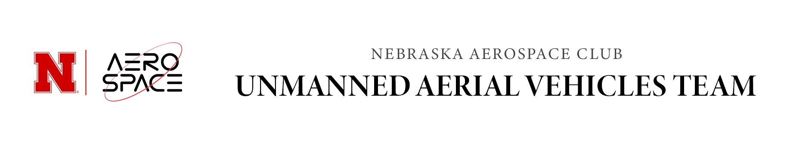

# Home

## Our Story

There are many important sectors of the aerospace industry, and one of the fastest growing and most hyped is that of the 'drone', or more properly, 'unmanned aerial vehicle' or 'system'- a UAV or UAS. With the beginning of the UAV Team, the Aerospace Club has opened up the possibility of projects which are almost entirely software based, bringing the realms of cutting-edge aerospace development directly to students of Computer Science and Computer and Software Engineering at the University of Nebraska-Lincoln.

## Mission 9 Objective:
1. Fly fully autonomous
2. Use ONBOARD computing (no data links except for kill switch and safety pilot override)
3. Avoid obstacles including:
a. Other aerial robots
b. Physical obstacles
4. Conduct the mission successfully (replace the module and return home) under 9 minutes

A link to the AUVSI IARC Mission 9 rules can be found here:  [MISSION 9 RULES](http://www.aerialroboticscompetition.org/rules.php)
