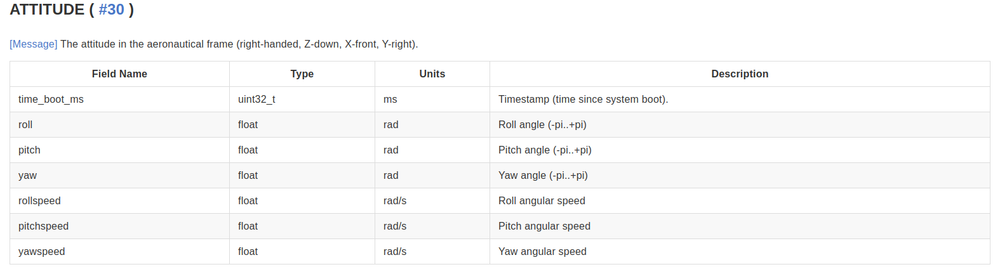

# Mavlink

### Description
Mavlink is a communication protocol that was created to be able to send/receive messages in a unifrom fasihon. The messages are defined in xml files which is refererred to as the dialect of the protocol.
A maximum of 255 devices can be connected via the mavlink protocl, and it only uses 14 bytes of overhead.

### Different Messages

{: style="width:150px"}

-	The message above is an attitude message that can be used to communicate to the drone what you want it to act like. The messages function as a packet and every message is composed of the same commponents.

### Message Components

{: style="width:150px"}