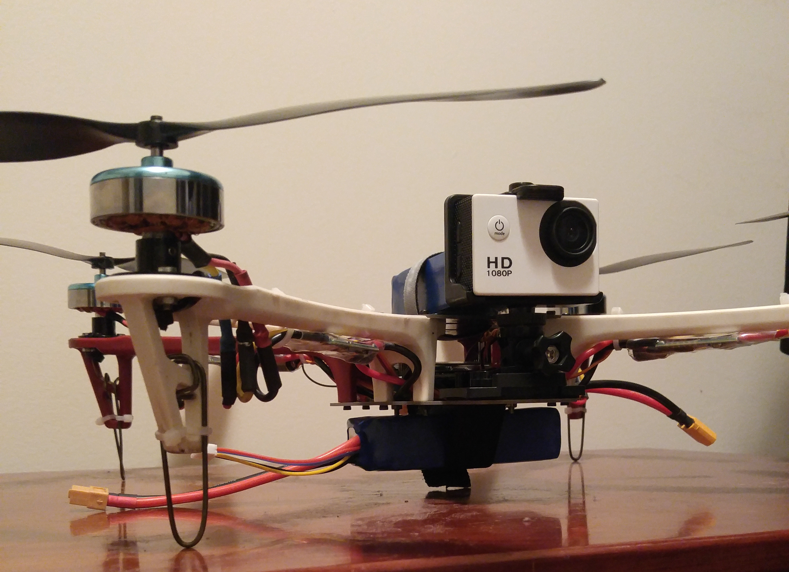
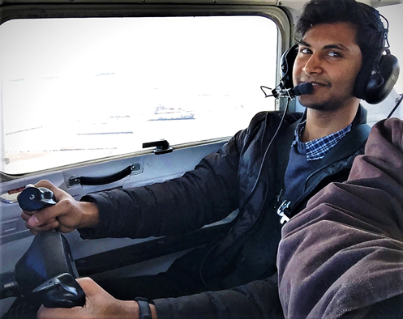

# Teams
## Hardware

{: style="width:562px;"}

For all the software work that goes into a UAV, it can't get off the ground without the necessary mechanical structures and systems for the software to interact with. To this end, our Hardware Group is tasked with designing, producing, and assembling all structural and mechanical components of the aerial system. These components have included everything from custom landing legs and specialty components for completing the competition, to a solution for battery attachment and testing and maintenance on the frame. This requires familiarity with the tools and equipment necessary for effective component production, including power tools, machine tools, and even a 3D printer, as well as computing tools. The computing tools used by the Hardware Group mostly consist of the program Solidworks, to include its 3D CAD design suite, as well as structural and fluid simulation. When simulations require a second opinion, ANSYS is utilized. 

## Software
[comment]: <> ()
For the aerial vehicle to be “unmanned”, or fully autonomous, a big chunk of computer programs have to be written for and implemented to it. This is the task our Software Group is assigned to tackle. The programming language utilized is C++.

## People

{: style="width:150px"}

** Andrew Hossack - President ** 

Computer Engineering Undergrad. Works with Unmanned Aerial Systems (UAS), embedded electronics, IoT, and has a passion in space exploration and most things that fly. Has experience in leading a multidisciplinary research and development team.

{: style="width:150px"}

** Timothy Gibbons - Software Developer **

Lorem ipsum dolor sit amet, consectetur adipiscing elit, sed do eiusmod tempor incididunt ut labore et dolore magna aliqua. Ut enim ad minim veniam, quis nostrud exercitation ullamco laboris nisi ut aliquip ex ea commodo consequat. Duis aute irure dolor in reprehenderit in voluptate velit esse cillum dolore eu fugiat nulla pariatur. Excepteur sint occaecat cupidatat non proident, sunt in culpa qui officia deserunt mollit anim id est laborum.

{: style="width:150px"}

** Pradhyun Kashyap - Remote Pilot and Support **

Unmanned aircraft systems, or drones are no longer toys or hobby, these are now a tool for entry into dozens of lucrative careers. As a Certified Remote Pilot, my job is to manage unmanned aerial vehicle flight operations and make sure to practice all the procedures and policies from Federal Aviation Administration (FAA) to include standard flight and ground operations. Also, my primary tasks include building flight vehicle structure and related components as a support assistance to the hardware team.